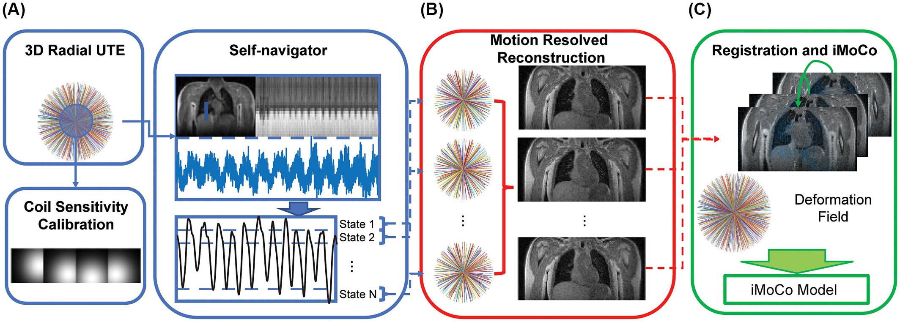
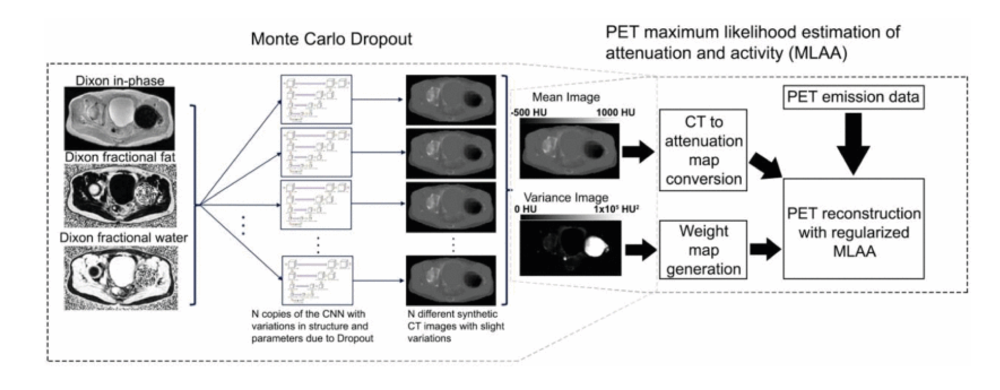

### Hyperpolarized Carbon-13 MRI: Methods

Hyperpolarized Carbon-13 MRI is a relatively novel imaging method of collecting in vivo metabolic information in a minimally invasive imaging procedure. Applications for this technique span various anatomical organs, including: cardiac, kidneys, brain, liver, pancreas, and clinical significances, such as: disease and cancer staging, response to therapy and surgical planning. UCSF pioneered this work with the first in vivo human study in 2013 and continues to be a strong leader in the field. Our group currently focuses on kidney and cardiac applications as well as development of acquisition methods and analysis tools to improve speed/SNR of imaging procedures and quantification of results.  

Our group has developed a “push-button” image acquisition methodology for semi-autonomous Hyperpolarized MR scans [1]. The user defines a region of interest (ROI) relative to the image volume, and then initiates the scan at the start of injection. The software is designed to autonomously perform all required calibrations and trigger acquisition: determine experimental timing (bolus tracking), adjust and capture MRI system properties (fine CF, B0, B1 calibration), and initiate rapid metabolic imaging. This system is defined using the [RTHawk Research Platform](https://vista.ai/products/research-rthawk/) from Vista.ai which safely adds a layer of functionality to our clinical scanner. Our rapid metabolic imaging method consists of alternating, metabolite-selective sequences which utilize either spectral-spatial or spectrally selective excitations. Coupled with automated bolus-triggering and calibrations, with our current methodology we are able to consistently maximize SNR and characterize near real-time metabolism.

Experiment Recordings:

* [Annotated Demo](https://youtu.be/ifZV_-7y7sY)
* [Human Brain](https://youtu.be/Oq36Z7ayQ0g)
* [Human Kidney](https://youtu.be/Joc9LABNRbc)

The dynamic metabolite maps acquired after reconstruction provide relative measurements over time. However, in most applications, we are interested in looking at other metrics that may serve as biomarkers. This includes model-free metrics such as the area-under-the-curve (AUC) or AUC ratios (for example, the pyruvate to lactate AUC ratio), as well as time-to-peak (TTP). Additionally, we can use and fit our acquired dynamic signals to a pharmacokinetic model to estimate apparent rate constants such as the pyruvate to lactate rate constant (kPL). Our group has worked on and developed an inputless one-compartment model [2] (can be accessed in the [Hyperpolarized MRI Toolbox](https://github.com/LarsonLab/hyperpolarized-mri-toolbox)).

1. Tang S, Milshteyn E, Reed G, Gordon J, Bok R, Zhu X, Zhu Z, Vigneron DB, Larson PEZ. A regional bolus tracking and real-time B1 calibration method for hyperpolarized 13 C MRI. Magn Reson Med. 2019 Feb;81(2):839-851. doi: 10.1002/mrm.27391. Epub 2018 Sep 18. PMID: 30277268; PMCID: PMC6289616.
2. Larson PEZ, Chen HY, Gordon JW, Korn N, Maidens J, Arcak M, Tang S, Criekinge M, Carvajal L, Mammoli D, Bok R, Aggarwal R, Ferrone M, Slater JB, Nelson SJ, Kurhanewicz J, Vigneron DB. Investigation of analysis methods for hyperpolarized 13C-pyruvate metabolic MRI in prostate cancer patients. NMR Biomed. 2018 Nov;31(11):e3997. doi: 10.1002/nbm.3997. Epub 2018 Sep 19. PMID: 30230646; PMCID: PMC6392436.

### Hyperpolarized Carbon-13 MRI: Kidney Studies

Chronic kidney disease and kidney cancer are two diametrically opposed pathologies but are connected in a number of ways and both pose significant public health challenges. UCSF Medical Center is a top 10 hospital in the nation and the best in Northern California for kidney care and each of its locations treats a large number of patients with kidney disease and kidney cancer. The wide-spread use of computed tomography (CT), ultrasound imaging (US) and magnetic resonance imaging (MRI) has led to an improvement on kidney disease and kidney cancer detection. However, the noninvasive prediction of renal tumor aggressiveness and rejection of kidney allograft remain a challenge with conventional imaging. As a highly energy dependent organ, the kidney requires mitochondrial oxidative phosphorylation and ATP generation for essential renal functions and protection against injury. Altered energy metabolism plays a central role in various kidney diseases and can be detected by hyperpolarized (HP) 13C metabolic MRI. To meet the clinical needs in kidney disease, our group is developing and applying HP 13C pyruvate MRI in patients with renal cell carcinoma (RCC) and patients with transplanted kidneys to identify novel imaging techniques and develop them into practical, useful diagnostic tools under the leadership of Drs. Jane Wang and Peder Larson.

For the research on patients with renal tumors, our group has published a paper in Cancer, an international interdisciplinary journal of the American Cancer Society. The paper describes the first study of a cohort of renal tumor patients with HP 13C MRI technology and correlations to tumor pathology. So far, we showed that HP 13C MRI enabled improved prediction of high-grade RCCs and the potential of incorporating metabolism information from HP 13C MRI to improve the prediction of aggressive renal tumors.

For the research on patients with transplanted kidneys, our group has presented our initial experience in applying HP [1-13C]pyruvate MRI to assess energy metabolism in patients with kidney allograft, and this work is ongoing.

1. Tang S, Meng M V., Slater JB, et al. Metabolic imaging with hyperpolarized 13C pyruvate magnetic resonance imaging in patients with renal tumors—Initial experience. Cancer. 2021;127(15):2693-2704. doi:10.1002/cncr.33554
2. Liu X, Lai YC, Cui D, et al. Initial experience of metabolic imaging with hyperpolarized [1‐13C] pyruvate MRI in kidney transplant patients. Journal of Magnetic Resonance Imaging. 2025 Apr;61(4):1969-78. doi: 10.1002/jmri.29580

### Hyperpolarized Carbon-13 MRI: Cardiac Studies

UCSF is one of six sites conducting hyperpolarized 13C cardiac MRI experiments, comparing healthy volunteers to hypertrophic cardiomyopathy (HCM) patients in collaboration with Dr. Roselle Abraham’s HCM clinic, a designated Center of Excellence. Hyperpolarized 13C offers a distinct advantage over FDG-PET, CEST, and 1H MRS, enabling the assessment of multiple metabolic pathways and the tracking of pyruvate-to-lactate and pyruvate-to-bicarbonate flux in a quick, non-invasive manner. Given that HCM is considered a metabolic disease, insights into various metabolic phenotypes and genotypes provide a foundation for tailored therapies. 

In this ongoing study, HCM patients and healthy volunteers are injected with 1-13C pyruvate and scanned at 3T with a Helmholz “clamshell” transmit coil and an 8-channel “paddle” receive array. The HP 1-13C pyruvate scan uses an autonomous scanning protocol (RTHawk) including metabolite-specific imaging using a spectral-spatial pulse and spiral readout to acquire 2D short-axis images. We perform pharmacokinetic modeling using a unidirectional three-site “inputless” model with one physical compartment to assess the conversion of pyruvate-to-lactate (kPL) and pyruvate-to-bicarbonate (kPB). Subjects undergo fasted and fed studies, with a dose of oral glucose given in between scans to assess metabolic response and glycolysis-glucose oxidation coupling. 

So far, we have demonstrated high quality metabolic imaging across the human heart in both volunteers and HCM patients.  We also showed that, in healthy participants, kPL and kPB increased after oral glucose consumption. Additionally, the correlation of kPB with blood glucose levels was highly significant. This aligns with the fact that a healthy, metabolically flexible heart utilizes fatty acids in the fasting state and transitions to more efficient oxidative phosphorylation when glucose is available. 

Kinetic rate maps in healthy volunteers before and after oral glucose load, overlaid on 1H anatomical images. These measures of LDH and PDH activity are relatively uniform across the LV myocardium in healthy volunteers.

1. Chen, Hsin-Yu, Jeremy W. Gordon, Nicholas Dwork, Brian T. Chung, Andrew Riselli, Sanjay Sivalokanathan, Robert A. Bok, et al. “Probing Human Heart TCA Cycle Metabolism and Response to Glucose Load Using Hyperpolarized [2-13C]Pyruvate MRS.” NMR in Biomedicine (2023): e5074. <https://doi.org/10.1002/nbm.5074>
2. Larson, Peder E. Z., Shuyu Tang, Xiaoxi Liu, Avantika Sinha, Nicholas Dwork, Sanjay Sivalokanathan, Jing Liu, et al. “Regional Quantification of Cardiac Metabolism with Hyperpolarized [1-13C]-Pyruvate CMR Evaluated in an Oral Glucose Challenge.” Journal of Cardiovascular Magnetic Resonance 25, no. 1 (December 14, 2023): 77. <https://doi.org/10.1186/s12968-023-00972-7>

### Lung MRI

MRI of the lungs has the potential to provide a range of anatomical and functional information to characterize the composition, structure, ventilation and perfusion. Use of pulmonary MRI is limited by relatively low signal due to the lower tissue density, artifacts and rapid signal decay rates due to magnetic susceptibility differences between tissue and air in the lungs, and tissue motion.

We are developing new techniques for high-resolution and functional MRI of the lungs. This includes the use of ultrashort echo time (UTE) pulse sequences that can efficiently capture the rapidly decaying signals. We have also pioneered novel data acquisition and reconstruction strategies that can account for motion while efficiently using data to maximize SNR. This includes dynamic 3D navigators [1], iterative motion compensation (iMoCo) reconstruction [2], and Motion-Compensated Low Rank (MoCoLoR) reconstruction [3]. In addition to providing high-resolution structural imaging, these methods can also measure ventilation by measuring changes across the respiratory cycle.

These methods are being translated into clinical studies, with a focus on pediatric imaging where it is desirable to eliminate CT scans and their associated radiation exposure. They are also being used with newly available commercial mid-field (0.5 T) MRI systems, which in the lungs are very promising due to the reduced magnetic susceptibility effects and longer signal decay rates.

Illustration of the iterative motion-compensation (iMoCo) reconstruction for UTE Lung MRI data [2], where respiratory motion can be estimated from the data itself. After dividing the data up into different motion states, images of each state are created via a motion-resolved reconstruction and then registered to each other. This is fed into the final reconstruction which can then use data from the entire free-breathing scan, maximizing the SNR efficiency.

Motion-compensated low-rank (MoCoLoR) reconstructions of UTE Lung MRI data across a range of patient research subjects with various ages, body sizes, and pathologies [3].

1. Jiang, Wenwen, Frank Ong, Kevin M Johnson, Scott K Nagle, Thomas A Hope, Michael Lustig, and Peder E.Z. Larson. “Motion Robust High Resolution 3D Free-Breathing Pulmonary MRI Using Dynamic 3D Image Self-Navigator.” Magnetic Resonance in Medicine, n.d., n/a-n/a. <https://doi.org/10.1002/mrm.26958>  <https://github.com/PulmonaryMRI/pulmonary-MRI-reconstruction>
2. Zhu, Xucheng, Marilynn Chan, Michael Lustig, Kevin M. Johnson, and Peder E. Z. Larson. “Iterative Motion-Compensation Reconstruction Ultra-Short TE (iMoCo UTE) for High-Resolution Free-Breathing Pulmonary MRI.” Magnetic Resonance in Medicine 83, no. 4 (2020): 1208–21. <https://doi.org/10.1002/mrm.27998>  <https://github.com/PulmonaryMRI/imoco_recon>
3. Tan, Fei, Xucheng Zhu, Marilynn Chan, Matthew A. Zapala, Shreyas S. Vasanawala, Frank Ong, Michael Lustig, and Peder E. Z. Larson. “Motion-Compensated Low-Rank Reconstruction for Simultaneous Structural and Functional UTE Lung MRI.” Magnetic Resonance in Medicine 90, no. 3 (2023): 1101–13. <https://doi.org/10.1002/mrm.29703>  <https://github.com/PulmonaryMRI/MoCoLoR>

### Myelin Imaging by UTE MRI

The myelin sheath plays an important role in normal brain function and development by facilitating long-range conduction of electrical impulses across the brain and protecting nerve fibers from injury. Loss or damage of myelin is implicated in numerous neurological disorders, including the neurodegenerative disease of multiple sclerosis (MS) associated with gross white matter damage and characteristic foci of demyelination. The benefits of myelin imaging include, myelination monitoring during aging in healthy subjects, early detection of demyelination, and assessing the treatment and re-myelination process in patients. However, due to the specific chemical environment of the bilayer-bound protons, 75% of the myelin lipid protons have T2 values well below 1 ms, which lead to magnetization decay too fast to be captured by conventional MRI techniques with TEs of milliseconds or longer.

The most promising method for direct measurement of myelin is ultra-short echo time (UTE) and/or zero echo time (ZTE) MRI pulse sequences. Most UTE sequences require the immediate application of the readout gradients after the completion of the RF pulses and a center-out k-space trajectory in each data acquisition to achieve the minimum possible TE, which is on the order of microseconds to capture the fast decaying signals of myelin protons. The main challenge for these methods is to separate myelin ultrashort-T2 signals from the much larger water proton signals using a combination of an inversion recovery (IR) suppression and a dual-echo subtraction. Other studies have fitted T2*-relaxometry based on multiple components exponential decay models to extract myelin signals, which shows potential for quantitative analysis.

We are working to develop and apply novel UTE MRI sequences and/or post-processing methods for direct myelin imaging. For example, utilizing novel non-Cartesian k-space patterns, multiple TE acquisitions, combining other MRI techniques like balanced steady state free precession (bSSFP) to UTE MRI, and establishing comprehensive fitting models to separate signals originating from myelin. In addition, we are partnering with collaborators at UCSF Neurology to apply these UTE MRI based imaging modalities to better characterize lesions in MS patients.

1. Boucneau, Tanguy, Peng Cao, Shuyu Tang, Misung Han, Duan Xu, Roland G. Henry, and Peder E. Z. Larson. “In Vivo Characterization of Brain Ultrashort-T2 Components.” Magnetic Resonance in Medicine 80, no. 2 (August 1, 2018): 726–35. <https://doi.org/10.1002/mrm.27037>
2. Deveshwar, Nikhil, Jingwen Yao, Misung Han, Nicholas Dwork, Xin Shen, Emil Ljungberg, Eduardo Caverzasi, et al. “Quantification of the in Vivo Brain Ultrashort-T2 * Component in Healthy Volunteers.” Magnetic Resonance in Medicine, January 30, 2024. <https://doi.org/10.1002/mrm.30013>

### PET/MR and PET Methods

Positron emission tomography (PET) provides valuable information about tissue function such as metabolism, perfusion, and more. Hybrid PET/MRI systems are recently introduced commercially, and combine the functional information from PET tracers with the soft-tissue contrast from MRI. For PET/MR we have worked on motion management, quantitative imaging, and image reconstruction, and several of these techniques have broad applicability for PET.

Spatially and quantitatively accurate PET requires knowledge of positron attenuation and tissue motion. For attenuation, this information is usually derived from CT, but is challenging to derive from MRI. We pioneered methods utilizing specialized ZTE MRI scans and also the use of deep learning for MR-based attenuation correction. Most recently, we integrated a Bayesian deep learning method directly with the PET reconstruction [1].  We have also integrated MRI-derived measurements of motion to correct PET data [2].

In addition to attenuation and motion correction, we have worked to more generally understand what information is shared versus what information is unique between PET and MRI. Our work generating synthetic PET data from MRI datasets illustrates typical PET distributions, which can be used for generating testing data but also identifying abnormal PET distributions [3].

PET/MRI reconstruction integrating MR-based attenuation correction maps and their expected uncertainty derived using a Bayesian CNN along with a maximum likelihood estimation of attenuation and activity (MLAA) method weighted based on the confidence of the attenuation maps [1].

1. Leynes, Andrew P., Sangtae Ahn, Kristen A. Wangerin, Sandeep S. Kaushik, Florian Wiesinger, Thomas A. Hope, and Peder E. Z. Larson. “Attenuation Coefficient Estimation for PET/MRI With Bayesian Deep Learning Pseudo-CT and Maximum Likelihood Estimation of Activity and Attenuation.” IEEE Transactions on Radiation and Plasma Medical Sciences, 2021, 1–1. <https://doi.org/10.1109/TRPMS.2021.3118325>
2. Yang, Jaewon, Mehdi Khalighi, Thomas A. Hope, Karen Ordovas, and Youngho Seo. “Technical Note: Fast Respiratory Motion Estimation Using Sorted Singles without Unlist Processing: A Feasibility Study.” Medical Physics 44, no. 5 (May 1, 2017): 1632–37. <https://doi.org/10.1002/mp.12115>
3. Rajagopal, Abhejit, Yutaka Natsuaki, Kristen Wangerin, Mahdjoub Hamdi, Hongyu An, John J. Sunderland, Richard Laforest, Paul E. Kinahan, Peder E. Z. Larson, and Thomas A. Hope. “Synthetic PET via Domain Translation of 3-D MRI.” IEEE Transactions on Radiation and Plasma Medical Sciences 7, no. 4 (April 2023): 333–43. <https://doi.org/10.1109/TRPMS.2022.3223275>

### Image Reconstruction

MR images are obtained in the frequency domain, or k-space, and are transformed, typically with a FFT to generate images for research and diagnostic purposes. However, since MRI is a  slower imaging modality compared to its peers like CT, recent research looked to develop methods to speed up the reconstruction process which can broadly be defined as model-based and deep learning based.

Model-based methods, including parallel imaging and compressed sensing use physical constraints to speed up the scan. Parallel imaging techniques such as SENSE and GRAPPA leverage spatial information from multiple receive coil signals to reconstruct MR images. This can reduce the acquisition time since k-space is undersampled while maintaining image quality. Compressed sensing exploits the inherent sparsity of medical images in the wavelet domain and uses iterative non-linear reconstruction solvers to converge to a generated image.

Deep-learning methods, and by extension, unrolled algorithms attempt to leverage the data consistency with traditional iterative reconstruction but also take advantage of learning from vast datasets to capture patterns and relationships on a population level that wouldn’t be easy using classic methods. These methods are data hungry and computationally expensive. 

Our research group has experience in developing and applying both types of methods, with our most recent work focusing on deep-learning methods. This has included developing a scan-specific, self-supervised method that does not require training or calibration data [1] and using deep generative models to synthesize large amounts of raw data from clinical images that can be used to train these models [2].

1. Leynes, Andrew P., Nikhil Deveshwar, Srikantan S. Nagarajan, and Peder E. Z. Larson. “Scan-Specific Self-Supervised Bayesian Deep Non-Linear Inversion for Undersampled MRI Reconstruction.” arXiv, December 9, 2023. <https://doi.org/10.48550/arXiv.2203.00361>
2. Deveshwar, Nikhil, Abhejit Rajagopal, Sule Sahin, Efrat Shimron, and Peder E. Z. Larson. “Synthesizing Complex-Valued Multicoil MRI Data from Magnitude-Only Images.” Bioengineering 10, no. 3 (March 2023): 358. <https://doi.org/10.3390/bioengineering10030358>

### AI Methods for Cancer Imaging

Biomedical imaging is an integral part of the management of cancer, from diagnosis to staging and monitoring response to treatments. Modern computer vision and AI techniques are set to revolutionize cancer imaging. We believe there are significant opportunities to create more reproducible assessments, automated quantifications of disease, and even discover new imaging characteristics of aggressive disease.

In primary prostate cancer and localized kidney cancer, the main challenge is to improve our identification of aggressive, clinically-significant disease. In primary prostate cancer, MRI is typically used prior to biopsy, offering an opportunity to better localize biopsy samples or even rule out the need for biopsy. We have curated an internal database of over 1000 prostate cancer patients with MRI. We have also developed a specialized, mixed-supervision deep learning method to utilize all available clinical pathology data regardless of its specificity, and this was shown to improve performance of identification of clinically-significant prostate cancer [1]. We also showed it can be used across different medical centers data with federated learning, a distributed method that doesn’t require data sharing [2].

We are also exploring projects using other imaging modalities where UCSF has significant experience such as PET for metastatic prostate cancer and CT for kidney cancers, all still aiming to improve our assessments of cancer with imaging.

1. Rajagopal, Abhejit, Antonio C. Westphalen, Nathan Velarde, Tim Ullrich, Jeffry P. Simko, Hao Nguyen, Thomas A. Hope, Peder E. Z. Larson, and Kirti Magudia. “Mixed Supervision of Histopathology Improves Prostate Cancer Classification from MRI.” arXiv, December 12, 2022. <https://doi.org/10.48550/arXiv.2212.06336>
2. Rajagopal, Abhejit, Ekaterina Redekop, Anil Kemisetti, Rushikesh Kulkarni, Steven Raman, Karthik Sarma, Kirti Magudia, Corey W. Arnold, and Peder E. Z. Larson. “Federated Learning with Research Prototypes: Application to Multi-Center MRI-Based Detection of Prostate Cancer with Diverse Histopathology.” Academic Radiology, Special Issue: Adapting after COVID, 30, no. 4 (April 1, 2023): 644–57. <https://doi.org/10.1016/j.acra.2023.02.012>
