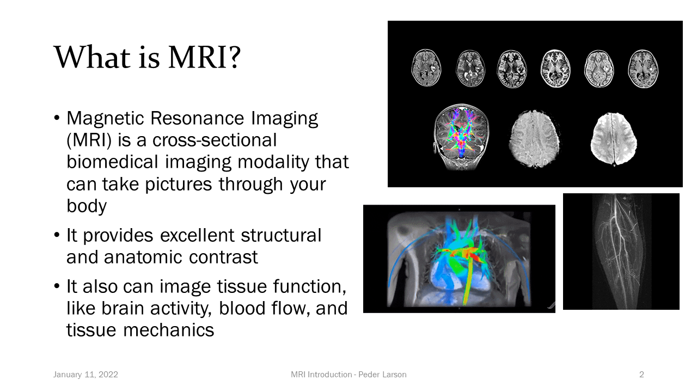

In Radiation Oncology, photons, protons, or electrons are used to treat cancer. Medical imaging is crucial in this process and allows us to visualize a patient’s tumor and healthy organs. The most common imaging modality used in radiation oncology is a computed tomography (CT) scan because it provides both anatomical information and a map of photon attenuation, which is necessary for calculating the dose delivered by the radiation. However, magnetic resonance imaging (MRI) is a powerful imaging modality that can provide very helpful information, such as excellent soft tissue contrast and functional information about tumor behavior. Therefore, MRI is becoming a very popular imaging choice in radiation oncology clinics. 

Figure 1. The UCSF Radiation Oncology Team having fun testing MRI sequences for imaging the pelvis. [Vida_volunteer.JPG]

One drawback of utilizing MRI in radiation oncology is that it does not provide a map of photon attenuation which is crucial for dose calculation. This can be explained by looking at examples of bone versus air. Bone is most dense biological material and will highly attenuate a beam of radiation. Air, on the other hand (like in the lungs), is not very dense and will minimally attenuate a beam of radiation. On a CT scan, bone is bright while air is dark. On MRI scans, both bone and air appear as dark (due to low proton density of air and bone and very short transverse relaxation time of bone). Because MRI pulse sequences cannot inherently provide information on photon attenuation, patients will often receive both a CT scan (for photon attenuation information) and MRI (for anatomical visualization). 

Figure 2. CT (left column) with corresponding MRI (right column) for the head (top row), spine (middle row), and pelvis (bottom row). Note the minimal signal produced from bone in MRI, versus the high signal from bone in CT. [CT_MRI_bone]

As most know from personal experience, getting imaged in a hospital isn’t a very fun experience! While medical images are important for our health care and can be interesting to look at, they can also cause anxiety from being inside a scanner, give additional radiation (in the case of a CT scan), require more time in spent in the clinic, and tend to be quite expensive. Provided that clinicians have the information they need to provide optimal care, most people agree that the fewer medical imaging procedures, the better. In radiation oncology, we are attempting to reduce the number of imaging procedures a patient needs by transitioning to an MRI-only workflow, which removes the need for a CT scan. To perform the crucial step of mapping photon attenuation for dose calculation, many groups are looking into generating synthetic CT scans from MRI. In other words, instead of a patient requiring both CT and MRI scans, in this workflow a patient would receive only an MRI scan, with the MRI used for anatomical visualization and MRI-generated synthetic CT for dose calculation. 

Over the past couple years, our group has investigated deep learning-based approaches for solving this problem. We have built deep learning models that take a single- or multi-sequence MR input image and generate a synthetic CT output image. In 2018, Dr. Andrew Leynes (an alumni PhD student of our group) investigated the effect of different input MR pulse sequences on accuracy of output synthetic CTs in the pelvis (reference). He found that scenarios involving metal implants can pose problems for MR-to-CT domain translation using Dixon-type MR pulse, as shown in Figure 3.

Figure 3. Dixon in-phase MRI (first row) used to generate corresponding sCTs (second row). The standard deviation map is shown (third row) to demonstrate differences between the synthetic CT and real CT. Largest disagreements are seen in the bone and metallic implant. [Dixon_sCT]

However, increased accuracy in sCT generation was found by using zero-echo-time (ZTE) MR sequences as the image input, as shown in Figure 4. 

Figure 4. Difference maps between real CTs and synthetic CTs generated from Dixon MR input images (top row) and from ZTE MR input images (bottom row) acquired for a pelvis scan. Note that ZTE MR-generated sCT agrees better with the real CT than the Dixon MR-generated sCT. [ZTE_dixon.jpg]

Our group recently published on a novel approach for generating sythetic MVCT from MRI (reference). MVCT scans are acquired directly on the radiotherapy treatment machine as opposed to traditional CT scans acquired using kV photon energies. In addition to not requiring a separate CT scanner, MVCT also has benefits over traditional kVCT in that it is more accurate for mapping electron density due to the physics of photon interactions at MV versus kV energies. In light of the advantages provided by MV imaging for dose calculation and availability of MV hardware on treatment machines, we propose a clinical pipeline in which MRI-derived synthetic MVCT be used for initial treatment planning and the already present high-energy MV photon beam for online dose adaptation on the treatment machine. This paradigm shift would offer a solution that eliminates the need for kV imaging systems for both initial treatment planning and online radiotherapy plan adaptation. 

Notably, approches for deriving synthetic CTs from MRI place constraints on the quality and robustness of deep domain translation techniques, as erroneous mapping of MRI to CT may result in under-dosing of tumors and/or over-dosing of nearby critical healthy structures. Standardization of sCT evaluation for radiotherapy applications remains a key challenge for successful implementation of this technology.  

Figure 5. Exemplar image demonstrating a single-input T1-weighted MRI (a) and single-output synthetic CT (b) generated from a 3D U-Net architecture for MRI-only radiotherapy treatment planning for a patient treated to a paranasal sinus tumor (66 Gray, prescription dose). The dose distribution calculated on the real CT (c) is shown for comparison, along with dose difference maps between synthetic and real CTs (d). Note some dose distribution differences at the anterior-nasal region where there is some disagreement in cartilage structure between real and synthetic CT images. [MR-CT-dose_comparison.jpg]

Some interesting problems we are currently investigating include synthesizing 3D megavoltage CTs from the combination of 2D radiographs and 3D MRI, mitigating limitations caused by differences in MRIs acquired in a radiology department versus a radiation oncology department, and improving differentiation between bone and air using ultrashort echo time (UTE) and zero echo time (ZTE) MRI techniques. 

References: 

Links

[Principles of MRI Recorded Lectures](https://www.youtube.com/playlist?list=PLjBt5Iq93BT9eXMsgevVTXKVv4BgVLB1X)

Graphics example - upload image in the assets/images/ folder

