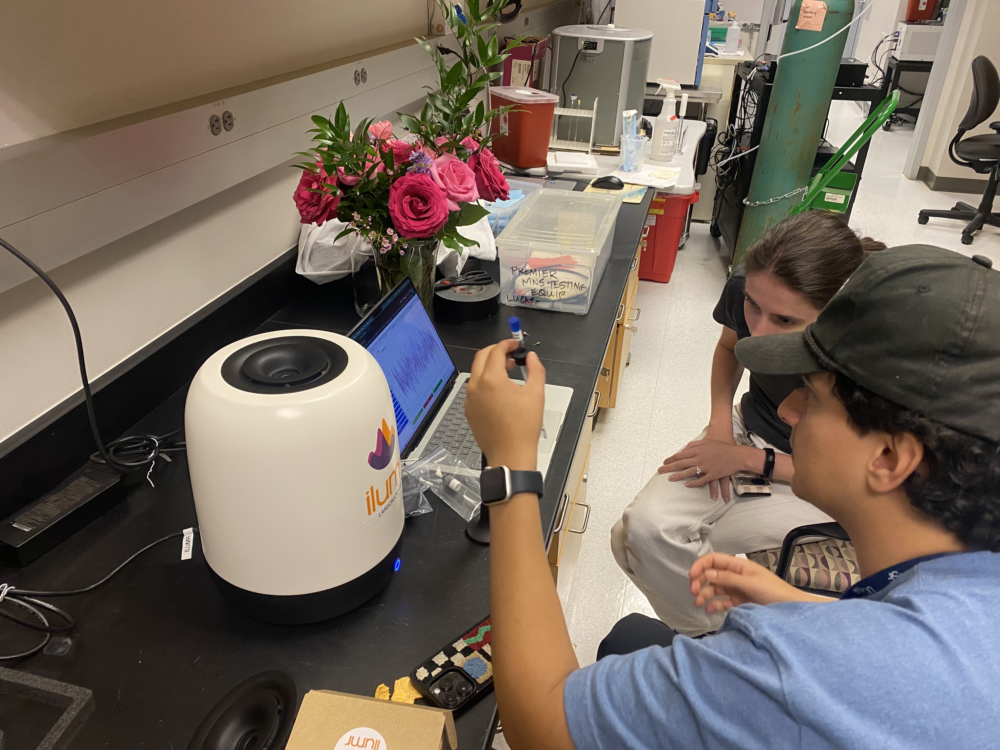
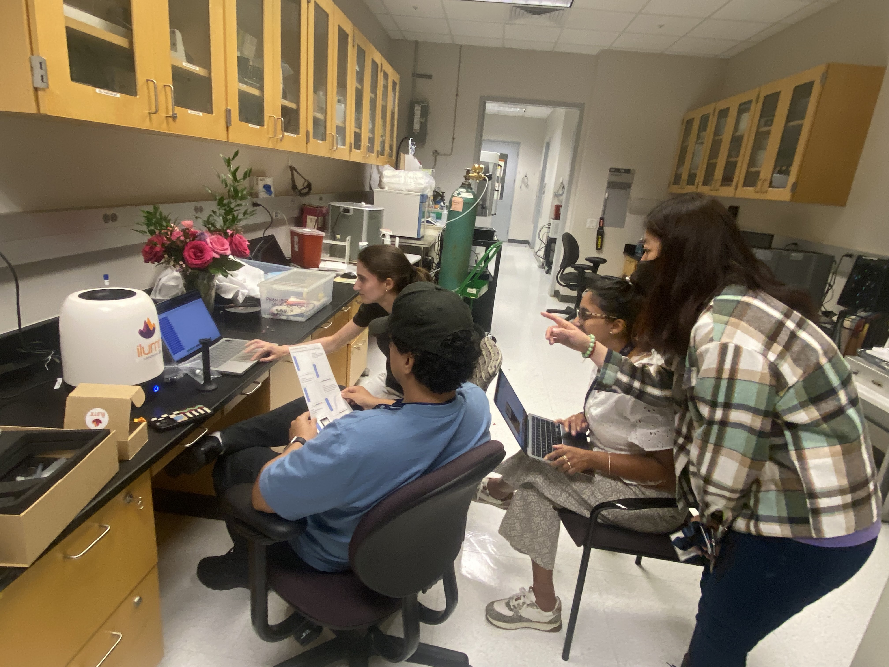

As the ISMRM Annual Meeting 2023 in Toronto, I was approached by a group of UCSF PhD students telling me I had to see something.  They led me over the to [Resonint](https://www.resonint.com/) booth in the vendor hall to experience the Ilumr tabletop MRI system.  This enterprising group of students was clearly impressed, and rightfully so!  

I got a demo right there with the system and was amazed.  There was a sleek system, fully contained on a tabletop, running via Jupyter-based web interface, and instantly delivering beautiful results.  It is a beautiful example of modern engineering with thoughtful design towards education and accessibility.  They are building open-source educational tools <https://github.com/Resonint/ilumr-courseware>, and the team was friendly and open with me for all my questions.  So, I began my quest to find the funds to buy one!

Long story short: I was fortunate in early 2024 to receive support from the UCSF Department of Radiology and Biomedical Imaging to purchase a system.  It arrived late April 2024, and now we have finally got to testing (thanks to delays preparing for and attending the ISMRM 2024 meeting).

The experience so far has been great!  Some learning curve to getting onto the system, but much less so than other MRI systems I've worked with.  It's being tested by PhD students, post-docs, post-BS/MS research assistants, undergrads, and even high school students!  I plan to integrate this into my MRI course in the Fall <https://larsonlab.github.io/MRI-education-resources/Introduction.html>, so stay tuned for more updates then. 

Small flower with 3D RARE

