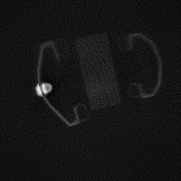

Ultrashort echo time (UTE) MRI pulse sequences use specialized approaches for RF excitation and data acquisition to minimize the delay between excitation and acquisition in order to capture rapidly decaying signals with short T2* relaxation rates.  These techniques also have a special place in my heart and research career, as they were the first MRI technique I worked on in my PhD.  And I have been fortunate that it has been a gift that keeps on giving, spawning multiuple biomedical research projects imaging bones, the lungs, tendons and other connective tissues, and myelin.  Thank you Dwight Nishimura for this gift!

UTE MRI techniques (and here I would include zero echo time or ZTE methods as the shortest TE technique) can also acquire signals from objects that we normally would not expect to be able to image with MRI.  I've accumulated a few of my favorites, from wood to rubber to plastics

### Violins
At the end of my PhD, one of my fellow students Joelle Barral had the idea to image her violin with UTE.  After making sure to remove the strings and other metal parts, the results were wonderful!

You can distinguish the different components, the fingerboard and pegs stood out with high signal maybe due to higher density and/or longer T2*.  The violin is made of wood but also has a varnish applied.  I'm actually a cellist, but have yet to try cello imaging, maybe next!

### RF coils

Some RF coils show significant signal on UTE MRI.  In this surface coil, there is a lot of signal where the reactive components are placed around the loop.

Here's another example shoing RF coil cables, housing, and other plastic material in patient table and positioning.

Weiger M, Pruessmann KP. Short-T2 MRI: principles and recent advances. Prog Nucl Magn Reson Spectrosc. 2019;114–115:237–70. https://doi.org/10.1016/j.pnmrs.2019.07.001

This imaging has some real-world use case for PET/MR and radiation therapy planning where photon attenuation of the coils maybe important to consider.  E.g. Mootaz Eldib et al 2015 Phys. Med. Biol. 60 4705  DOI 10.1088/0031-9155/60/12/4705 

### Other stuff

I used to use a wood block as a phantom for UTE, which has quite low proton density but is visible with efficient techniques!  Below  you can see my wood block phantom, placed next to a pair of headphones and also in a plastic boot used to immobilize the ankle.

Rubber has become a more popular UTE phantom, particularly becuase its T2* is similar to some in vivo signals like cortical bone, and also it has more proton density than my wood phantoms.

Weiger M, Pruessmann KP. Short-T2 MRI: principles and recent advances. Prog Nucl Magn Reson Spectrosc. 2019;114–115:237–70. https://doi.org/10.1016/j.pnmrs.2019.07.001