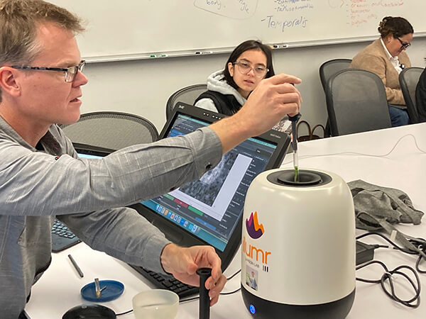

Imagine being able to scoop up your MRI scanner, bring it into a classroom, and then live-demo MRI experiments alongside typical classroom materials.  This was what I was able to do during my Fall 2024 UCSF course, "Biomedical Imaging 201: Principles of MRI," with the Ilumr 0.34 T Tabletop MRI system from [Resonint](https://www.resonint.com/).  As a teacher, I loved the experience, it felt so fresh and active, and truly a way to bring the course material to life.  My department published a blog and produced a short video, you can check them out below.  Here I'll also share some more specific insights into my experience.

## UCSF Blog Posts

<https://radiology.ucsf.edu/blog/tabletop-mri-enhances-classroom-learning-msbi-students>

<https://youtu.be/wTbi7k-jmjY>

My favorite quotes from the blog:

"In Larson’s classroom ..., students have on their table a machine that vaguely resembles a rice cooker or a speaker about to throw down some serious bass."

"It's a tabletop MRI scanner, the Ilumr from Resonint, weighing about as much as a toddler",

"Larson's classes have taken on a playful yet informative tone, with everyday objects becoming subjects of MRI scans. From juicy blackberries to crunchy cauliflower florets, students image a variety of samples, learning about signal intensity, contrast, and spatial resolution. As the machine softly whirrs like a gentle air conditioner with occasional beeps, students witness the effects of motion artifacts by gently wiggling the sample tube during a scan, creating intriguing "ghost" images, or drop a metal contaminant, either steel or brass, into the sample tube to show how signal is destroyed and how artifacts pile up in the image."

## General Tips

* **Startup**: Warming up the system takes ~30 minutes for temperature and field to stabilize.  But, even if it is not stable, this is a good teachable moment to show how MRI is sensitive to field changes
* **Wobble**: Not essential to do every time, but once or twice the coil was detuned and SNR was poor.

## Samples 

- **Doped water**: Most often I just used the water shim tube, for ease of use and consistency.  You can demonstrate a lot with just that.  Easy to see effects of spatial resolution, SNR, artifacts such as displacement and motion.
- **Structure Phantoms**: The structural set of phantoms provided are also nice for slice selection and more structure, but take more time to setup properly.
- **Lunch**: I often used a small piece of food from my lunch, and these ended up giving some of the most interesting images!  Rolled up lettuce, pieces of rice, salami, and cheese, and cauliflower all worked very well.  

## Sequences
* **Advanced RARE**:  I used this sequence most frequently, and it is extremely relevant given its high usage for in vivo MRI.
* **FISP**: This sequence was also quite efficient, so I used this on occasion.  The unique steady-state of this sequence I find to be quite complex, so put it beyond scope of my course, which made me hesitant to use this more.

## Experiments
* **Resonint Labs**: Resonint provides a fantastic set of Jupyter Notebooks to illustrate many concepts.  I had students try these themselves and also used for some in class demos.  <https://github.com/Resonint/ilumr-courseware>
* **MRI System**: The Lab 1: Intro to NMR" nicely covered this, I liked the wobble to illustrate RF coils.  I also had not explicitly covered shimming before so this was nice addition. 
* **Contrast**: I did not have much success demonstrating the "weighting" concepts of  contrast (e.g. T1, T2, PD), partly due to lack of phantoms, and not having a simple GRE sequence also made this more challenging.  Chemical shift was also not easy to demonstrate given the low magnetic field strength.
* **Spin-Echoes**:  Very easy to demonstrate with included Labs and Apps.
* **RF Pulses**:  The Pulse Calibration App was a very clear demonstration of pulse power/flip angle.  Slice selection was very easy to demonstrate by ensuring the image was resolved in the slice select direction.  Lab 3 was great for this as well.
* **K-space and Fourier Transforms**:  There were nice ways by imaging the RF pulse profiles and also by looking at the frequency spectrum from the samples to illustrate concepts like rect/sinc pairs and the stretch/shrink property of the Fourier Transform.  The 1D SE App was useful for this.
* **Image Formation**:  It was easy to demonstrate properties of frequency encoding by showing the spectrum of the signal.  Phase encoding, as I expected, was not so easy to show.  I took some parts of Lab 2 for this. 
* **Image Characteristics**: I did some simple demonstrations using RARE sequence of tradeoffs between *scan time, resolution, FOV and SNR.*  This was relatively simple, but I think cannot be understated how important this is in practical use of MRI.  This is the constant exercise of MRI practitioners, to balance desired contrast with scan time, resolution and SNR, and I think is incredibly valuable. 
* **Fast Imaging**:  The RARE sequence app was great for this topic.  But there was no EPI sequence.   Since it is single channel, there's no opportunity for parallel imaging.  I didn't attempt any compressed sensing. 
* **Aliasing**: I had to go into the configuration files to figure out how to change the FOV, but with this was able to nicely demonstrate aliasing.
* **Motion**: I was able to induce motion artifacts by shaking the shim during imaging.  It was better without averaging, since averaging can remove some of this artifact.
* **Susceptibility Effects**: I had some fun with this concept by inserting some non-magnetic metals into the sample tube.  In some cases, the signal was completely lost, and in others, the signal was just distorted.
* **Flow**: This was not a classroom demonstration, but was a final project by a group of students using the Flow Imaging Kit I got with the system.  Experimentally this was very successful!  I made a simple batch of doped Gd water (~1:100 Gd agent:water) which was effective.

## Future Ideas

* **Simple gradient echo sequence**:  It would have been nice to have a simple GRE sequence to demonstrate, for example, Ernst angle, T1 contrast, and T2* effects.  Probably this is not very SNR efficient.  It may also exist on the system but not as one of the main Apps.
* **EPI**:  I'm not sure how well this would work on the system, but this is a workhorse sequence of modern MRI.
* **Pulse programming**: I did not get to this, but it would be a great to try to build new sequences to test, and also a way to show the students how the sequences are built and how they can be modified.  It seems doable, but thus far have not had the time to do it.

