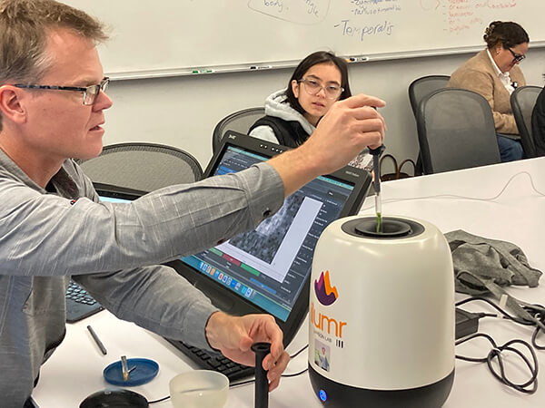

Lung ventilation is important because ...

The use of MRI for mapping ventilation has grown significantly recently
Key events: FDA approval of HPX, dissemination of 2D V/Q methods, multiple advances in respiratory phase-resolved imaging

Already in 2025 two papers have been published on structure/function methods using phase-resolved 3D UTE MRI, and comparing them to HPX ventilation

<https://analyticalsciencejournals.onlinelibrary.wiley.com/doi/10.1002/nbm.70033>

<https://onlinelibrary.wiley.com/doi/full/10.1002/mrm.30416>

MRI Ventilation Methods

* HPX - pros: direct measurement, cons: specialized equipment, costs
* 2D phase-resolved methods (Fourier Decomposition, PREFUL)
* Oxygen Enhanced
* Structure/function with phase-resolved 3D UTE

Technical Challenges 

* Importance of image registration
* Ventilation processing - most of these methods provides relative, not absolute, measures of ventilation, so additional processing is required.  Usually VDP.  I think some of the differences between the two papers is due to differences in this processing

Experimental Challenges

* Physiologic - breath-hold versus tidal breathing versus forced exhalations could lead to different measurements

Add in a couple key images.  Also want a small image for the 'logo' of the post that is references by 'image:' at the top

