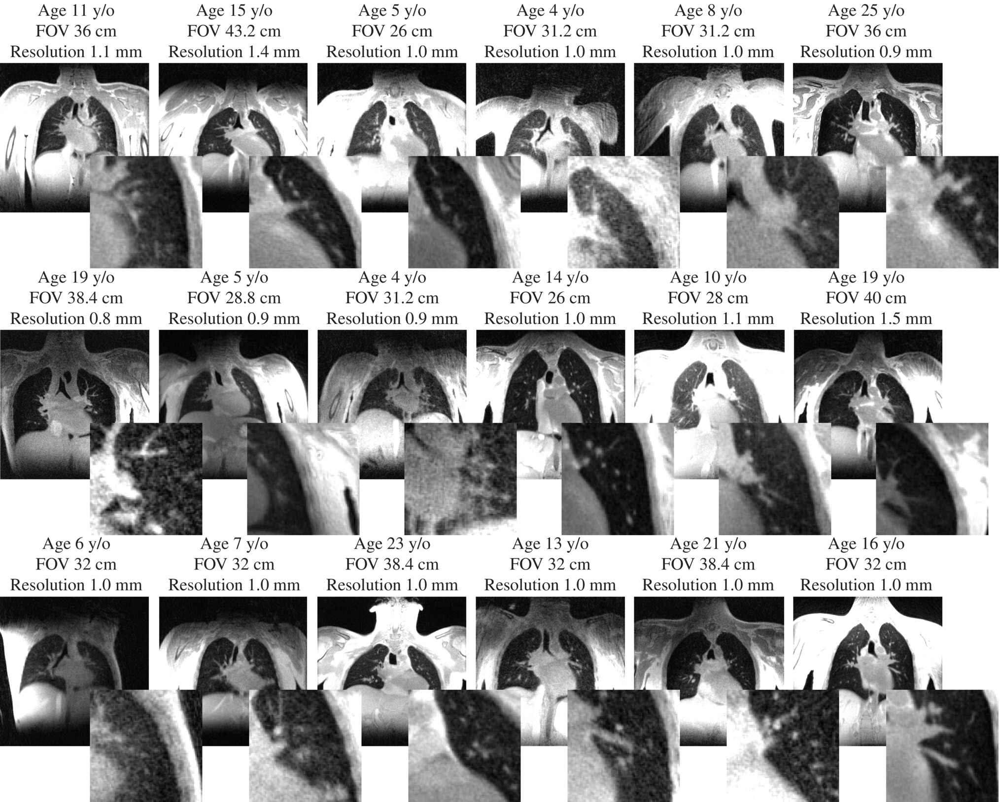
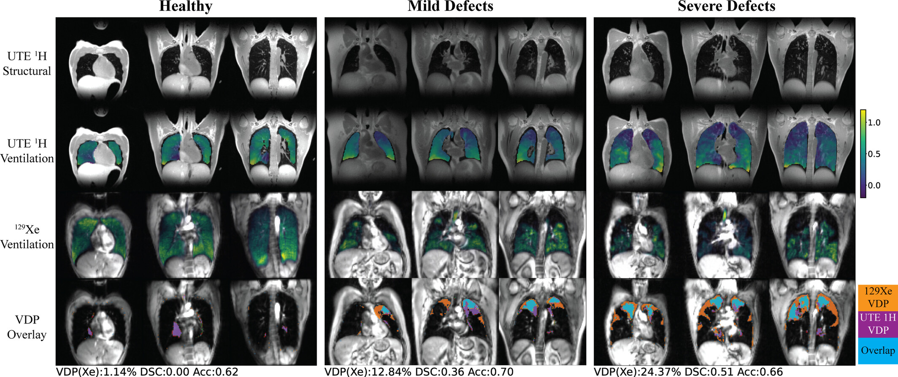

I was recently asked to participate in a "Pulmonary MR Virtual Office Hours", a session intended to allow experienced researchers to connect with others in the field and share their experience.
This is a new initiative by the newly formed ISMRM Pulmonary MR Study Group.  It got me thinking about my own journey into lung MRI research as well as my current opinions in the area, which I thought I would share here.

## The Journey

I got into lung MRI very surreptitiously through a collaborator on a project that was given to me, and had no idea where it would go.  UCSF had purchased a new PET/MR system, and I'd been tasked with developing sequences and research projects on the system.  Dr. Thomas Hope identified an unmet need of pulmonary nodule detection when performing PET/MR, and also had seen Prof. Kevin Johnson's recently published seminal paper on [Optimized 3D ultrashort echo time pulmonary MRI](https://pmc.ncbi.nlm.nih.gov/articles/PMC4199575/).  Prof. Johnson was a very willing collaborator and we were able to execute a successful study on [Detection of Small Pulmonary Nodules with Ultrashort Echo Time Sequences in Oncology Patients by Using a PET/MR System](https://pmc.ncbi.nlm.nih.gov/articles/PMC4699498/).

Following this, Prof. Miki Lustig and myself expanded our collaboration with Kevin Johnson, who identified that motion artifacts were a key limitation when using UTE in the lungs.  We started with several challenging pediatric imaging datasets from UW-Madison, and worked on [Motion robust high resolution 3D free‐breathing pulmonary MRI using dynamic 3D image self‐navigator](https://pmc.ncbi.nlm.nih.gov/articles/PMC6474413/).  Eventually, we also started doing many more clinical studies at UCSF, with a focus on the challenging but impactful pediatric population, and built off these datasets to build new tools for high-resolution reconstructions in the presence of motion, including [Iterative motion‐compensation reconstruction ultra‐short TE (iMoCo UTE) for high‐resolution free‐breathing pulmonary MRI](https://pmc.ncbi.nlm.nih.gov/articles/PMC6949392/) which has be come a popular tool in the field.

I learned from this journey to have an open mind about new research ideas, especially when working with collaborators you trust, and I try to maintain some time to explore some more high-risk, unfunded research directions.  I also learned humility about pulse sequence programming - my success in this area has hinged in the amazing pulmonary UTE sequence from Kevin Johnson at UW-Madison, and if we tried to reproduce this ourselves I'm not sure I would still be in the field!

## Current Priorities

I am currently very excited about the potential for lung MRI.  Our current priorities include functional contrasts and mid-field MRI.

In numerous conversations with radiologists and pulmonologists I received feedback that, for MRI to be successful, it needs to go beyond what CT can provide.  I believe MRI will never achieve the spatial resolution and speed of CT, but I think it can succeed by providing an array of contrasts.  Reduced radiation exposure is also an advantage, although modern low-dose protocols and photon-counting CT systems are impressive in using very small doses of radiation.  

### Functional Imaging

One theme from clinicians was they would want to see functional contrast, such as ventilation.  We focused on performing respiratory-resolved reconstructions of free-breathing UTE data as in [Motion‐compensated low‐rank reconstruction for simultaneous structural and functional UTE lung MRI](https://pmc.ncbi.nlm.nih.gov/articles/PMC10501714/), from which ventilation maps can be derived.  We have also begun to get experience with other exciting ventilation/perfusion mapping methods such as [Phase-resolved functional lung (PREFUL) MRI Method](https://doi.org/10.1002/mrm.26893).

Based on a collaboration with Dr. Jonathan Rayment and Prof. Rachel Eddy at University of British Columbia [Three‐Dimensional Free‐Breathing Ultrashort Echo Time (UTE) 1H MRI Regional Ventilation: Comparison With Hyperpolarized 129Xe MRI and Pulmonary Function Testing in Healthy Volunteers and People With Cystic Fibrosis](https://pubmed.ncbi.nlm.nih.gov/40235063/), I don't think a UTE or other 1H approach is as sensitive as hyperpolarized xenon-129 gas MRI, but they have the advantage that it can be added onto existing MRI scans with no extra hardware or agents.

### Mid-field MRI

UCSF recently purchased a "mid-field" MRI system, the Siemens Healthineers 0.55T Free.Max.  While many applications suffer from the reduced polarization compared to 1.5 and 3 T MRI scanners, I think pulmonary imaging is actually better at this field strength.  This is due to the reduced susceptibility effects at the numerous air-tissue interfaces in the lungs, which results in for longer T2/T2* relaxation times.  Not only does this counteract some of hte polarization loss in maintaining SNR, it also allows for other contrasts such as T2-weighted and diffusion-weighted imaging.  A bonus is that mid-field systems have lower magnet and siting costs, making them more accessible. 

We are actively deploying lung MRI protocols at 0.55T, testing and running clinical scans, and determining how we can turn this system into a viable modality for clinical lung imaging.

## The Future

What does the future hold for lung MRI?  I'm excited about the expansion of the lung MRI research community, both due to the free.max and similar mid-field systems as well as the recent FDA approval of hyperpolarized xenon-129 gas MRI (HPX).  There were some excellent questions at the Virtual Office Hours that revealed areas where I think there is important work to do to move the field forward, including motion management, pulse sequence support, and leveraging open-source software.

Managing motion in the lungs for clinical studies is still very challenging, particularly for our patients with compromised lung function who may breath irregularly, cough, and not be able to perform breath-holds.  Still one of the challenges faced in my groups work is how to extract reliable estimates of motion.  I think it is something that is not always well definied in the literature, and unspoken challenge that we all assume is a solved problem.  Clinical deployment requires high reliabilities, I'd guess upwards of 95% success rates, and I think we are not there yet.

Lung MRI also suffers from relatively poor vendor support.  
Most vendors do not provide FDA-approved pulse sequences (e.g. UTE) that work well for lung MRI, although there are generally works-in-progress (WIP) research prototypes available.  I think some hesitation is that the demand for lung MRI scans is small, so there is not a significant financial incentive.  The field has benefitted immensively from Prof. Kevin Johnson's GE scanner sequencer, and I've also seen some great utility of the Siemens stack-of-spirals UTE sequence.  We can work with clinicians to increase demand and also encourage vendor support whenever possible. 

I'm a huge proponent of open-source software, founding the [PulmonaryMRI GitHub Organization](https://github.com/PulmonaryMRI/), and I think we are in a bit of a golden age for open-source MRI.  It is now widely accepted as beneficial to advancing MRI, and the introduction of open-source pulse sequence programming via tools such as Pulseq has opened up this realm that was historically tied into specific vendor environments.  https://github.com/PulmonaryMRI/ currently hosts mostly reconstruction software, and I would love to see some more pulse sequences as well as image analysis tools become available.  

Finally, I've been impressed and fascinated by the progress of Hyperpolarized Xenon-129 gas MRI (HPX) as now a clinically reimbursable study.  This is potentially a game-changer for lung MRI, if HPX can be a robust study ordered by clinicians in their normal workflow.  The next couple of years will be important to see if this transition can occur from research to the clinic.  Who knows, maybe I'll dabble in HPX someday!