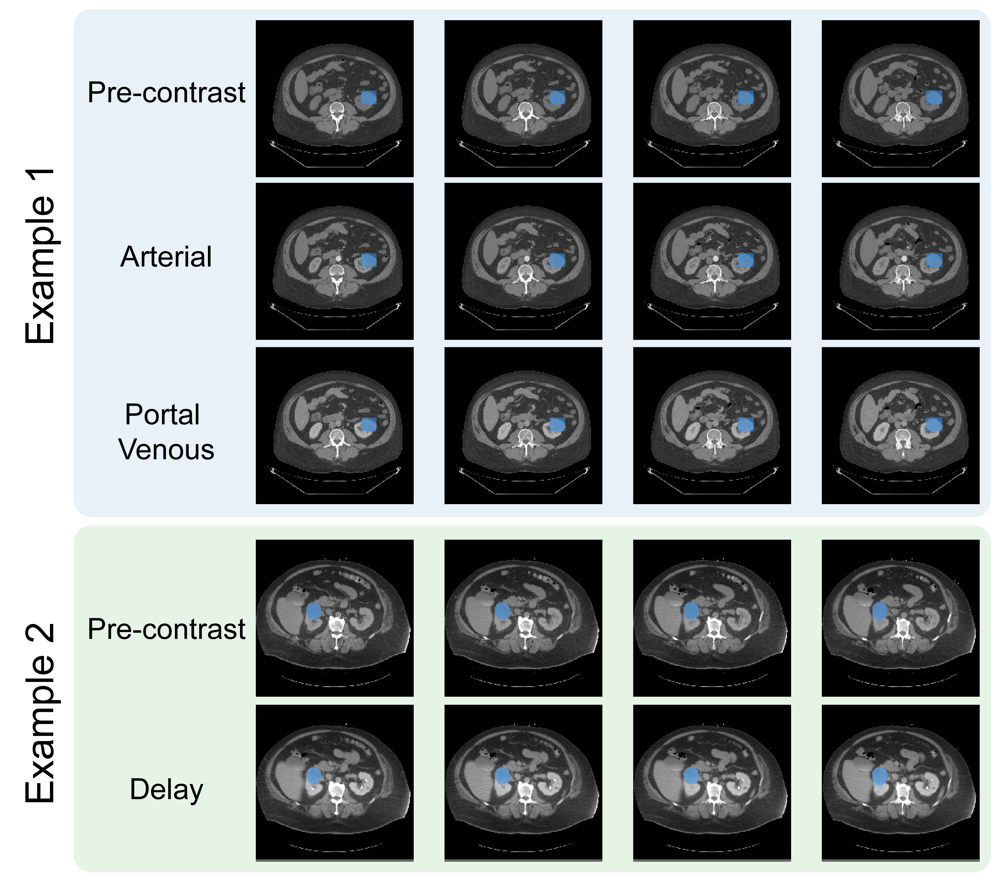
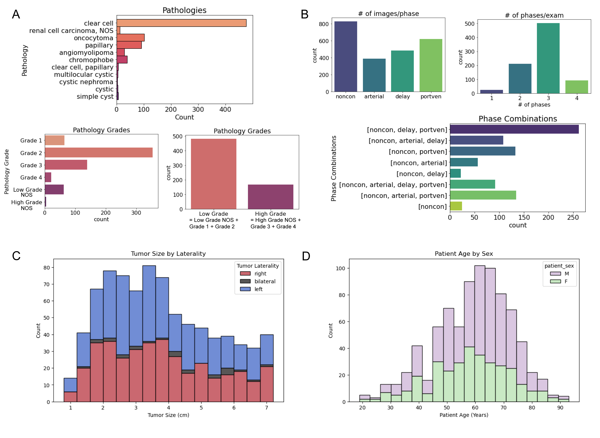

In the late 2010s, my abdominal radiologist collaborator Dr. Jane Wang approached me with an idea to curate a dataset of CT scans of renal masses.  This was and still is a challenging clinical question, as about 20% of renal masses that are surgically removed even after imaging are found to be benign, meaning that many unncessary procedures are being performed.  Multi-phase CT scans are the standard of care, although MRI and other alternatives are an active area of research.

Inspired by the advances occuring in deep learning, we received regulatory approval and set Dr. Sage Kramer, a radiology resident at the time, to begin collecting and annotating the most recent multi-phase CT exams of patients prior to surgery.  After surgery, we had pathology results describing the mass and, in the case of cancer (renal cell carcinoma, or RCC), the tumor was graded by expected severity.

While this project moved slower than we had hoped due to no available funding and changes in personnel, I was ultimately very happy that we accumulated and annotated 831 cases, which I believe is the largest collection of such type of data to date!

The dataset link is below, along with a repository containing curation code and tutorials for how to use the dataset.  Read below for my thoughts on the experience and data.

- [UCSF Imaging Datasets – UCSF-RMaC](https://imagingdatasets.ucsf.edu/dataset/3)
- [AWS Open Data Registry – UCSF-RMaC](https://registry.opendata.aws/ucsf-rmac/)
- [GitHub – LarsonLab/UCSF-RMaC](https://github.com/LarsonLab/UCSF-RMaC)

## Dataset Sharing Process

We made some modest attempts to do our own model development based on this dataset, but ultimately felt that our most significant contribution could be to publicly share the dataset for the community to use.  I was honestly quite intimidated by the dataset sharing process having never done it before.  I had no idea what regulations, requirements, costs, or other hurdles we might encounter.  Fortunately it turned out to be a relatively smooth process, and smooth enough that I plan to publicly share more datasets in the future.

The basic process consistented of internal approvals, an application to AWS OpenData, and then posting of the data.  The people and processes I worked with I felt were all designed to *help and encourage* the sharing, and that made a huge difference.  Both UCSF and AWS personnel were quick to answer any questions and get approvals made.

## Renal Mass CT Challenges

This problem and the dataset has some inherent challenges, that I hope researchers can address when they use it.  A driving challenge in this area is the availability of datasets, so we tried to include as many cases as possible.

The major challenge within the images is variations in CT protocols as many renal masses are incidental findings, discovered on CT scans performed for other reasons.  This means the scan protocols are not standardized, and can include variable contrast timings, resolution, and even cases where patients were flipped between the non-contrast and post-contrast phases.  

The protocol variations as well as the propensity of the abdomen to move posed significant image registration challenges.  I believe that registration is important to maximize the information that can be extracted from the multiple CT phases.  These are the images before contrast as well as at different timings following administration of an iodinated contrast agent.  My former PhD student, Dr. Sule Sahin, led the image registration process and had to work with different algorithms as well as varying degrees of automatic versus manual registrations.  We released both the registered cases as well as those that failed registration.  These failed cases are included in case others have more success in registration, or can make use of the data without image registration.

## What's Next?

I am highly motivated based on this positive experience to support sharing of additional biomedical datasets.  I believe the research community has realized the benefits of such sharing, and I hope we continue to find ways to give "academic credit" for such efforts.  We have a primary prostate cancer MRI dataset that is coming next!

It is also an invaluable learning experience to go through the entire process of dataset creation, from gathering data, curating the data, and sharing the data.  My main takeaway was to be very intentional particularly in the data curation, with clear definitions of image annotation criteria, collection of study metadata, and how to store data.  My quick takeaways: ideally annotation includes at least 2 individuals; more is generally better for metadata; hdf5 containers are a very easy format to use, although some in medical imaging prefer DICOM. 