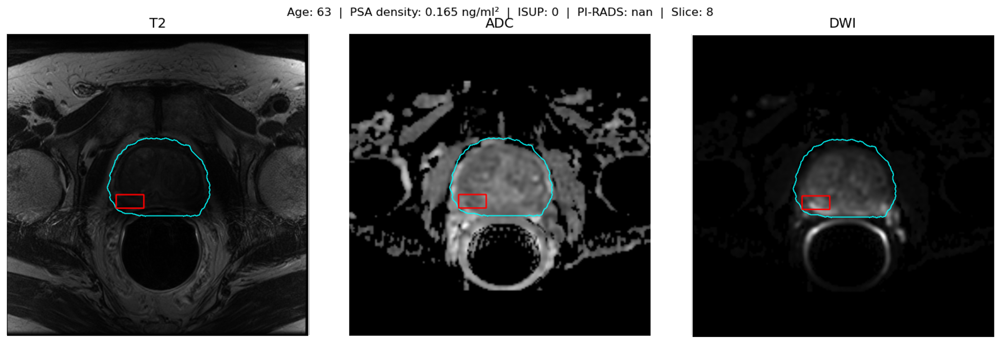
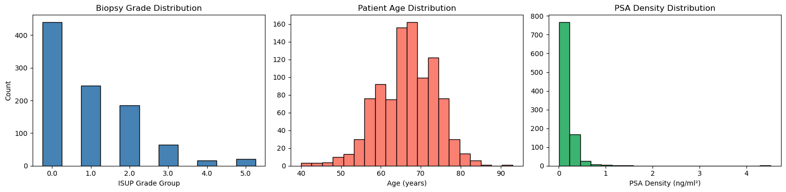
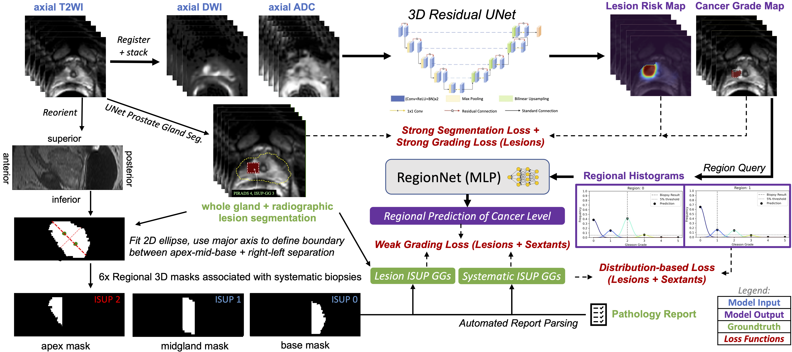
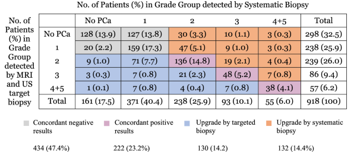
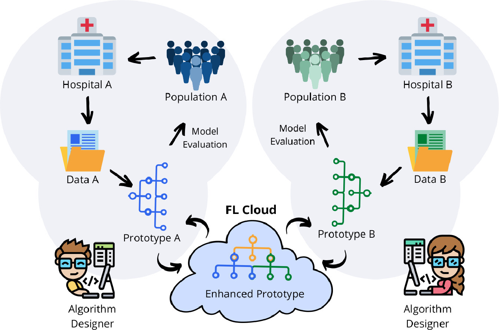

We are proud to announce the public release of our UCSF Prostate MRI dataset, which includes 973 multi-parametric MRI exams  with corresponding systematic and targeted biopsy results.  It was an incredible resource for our own research as well as collaborative research projects (e.g. PI-CAI), and we hope it will be a valuable resource for the research community.

The dataset link is below, along with a repository containing curation code and tutorials for how to use the dataset.  Read below for my thoughts on the experience and data.

- [UCSF Imaging Datasets – UCSF-ProstateMR](https://imagingdatasets.ucsf.edu/dataset/5)
- [GitHub – LarsonLab/UCSF-ProstateMR](https://github.com/LarsonLab/UCSF-ProstateMR)





## Established Value of this Dataset

This dataset has already proven to be valuable for research, including algorithm development and testing, given that each case had the following:
- Bi-parametric Imaging: Axial T2, high b-value DWI and ADC images. These were registered and normalized based on pixel intensity values within the prostate gland
- Segmentations: Bounding boxes for each MRI lesion and gland segmentation of the prostate gland
- Pathology: Both MRI/US fusion-guided (i.e. targeted) biopsy and systematic (i.e. nontargeted) biopsy results
- PI-RADS scores of each prostate lesion identified on MRI
- Other clinical data including PSA density and prior history of prostate cancer

Other unique aspects of this dataset
- Both cases with and without endorectal coil
- Demographic data available
- Small subset of patients with multiple exams

### Prostate Cancer Classification

Our primary goal with this dataset was to improve clinically significant prostate cancer classification from MRI using a combination of pathology sources. MRI-US fusion biopsy results are associated with a relatively small MRI target and thus can provide strong supervision during training. Systematic biopsy results are associated only with a sextant of the prostate gland and thus can only provide weak supervision. 
We used a novel architecture and training strategy using mixed supervision which allowed for both types of biopsy results to be contribute to improving model performance.



```
Rajagopal A, Westphalen AC, Velarde N, Simko JP, Nguyen H, Hope TA, Larson PE, Magudia K. 
Mixed supervision of histopathology improves prostate cancer classification from MRI. 
IEEE transactions on medical imaging. 2024 Mar 28;43(7):2610-22. doi: 10.1109/TMI.2024.3382909
https://pmc.ncbi.nlm.nih.gov/articles/PMC11361281/
```

```
Rajagopal, A., Magudia, K., & Larson, P. E. Z. (2023). 
Machine learning techniques for tumor identification, classification, and grading
(U.S. Patent Application Publication No. US20230410301A1). The Regents of the University of California. 
https://patents.google.com/patent/US20230410301A1/en
```

### Use of ultrasound, MRI and biopsy

With the richness of this dataset, we also had information about whether lesions identified on MRI were visible on ultrasound at the time of biopsy. This allowed us to explore the utility of both MRI and ultrasound in identifying clinically significant prostate cancer at the time of biopsy compared to systematic (i.e. nontargeted) biopsy approaches.



```
Velarde N, Westphalen AC, Nguyen HG, Neuhaus J, Shinohara K, Simko JP, Larson PE, Magudia K. 
US lesion visibility predicts clinically significant upgrade of prostate cancer by systematic biopsy. 
Abdominal Radiology. 2022 Mar;47(3):1133-41. doi: 10.1007/s00261-021-03389-x
https://pmc.ncbi.nlm.nih.gov/articles/PMC8863714/
```

### Federated Learning

Federated Learning is a machine learning technique that allows for training of models across multiple institutions without sharing patient data.  We were able to use this dataset to explore and test available federated learning methods.



```
Rajagopal A, Redekop E, Kemisetti A, Kulkarni R, Raman S, Sarma K, Magudia K, Arnold CW, Larson PE. 
Federated learning with research prototypes: application to multi-center MRI-based detection of prostate cancer with diverse histopathology. 
Academic radiology. 2023 Apr 1;30(4):644-57. doi: 10.1016/j.acra.2023.02.012
https://pmc.ncbi.nlm.nih.gov/articles/PMC10869141/
```


## PI-CAI

[PI-CAI](https://pi-cai.org/) (Prostate Imaging: Cancer AI) is a multi-institutional collaboration to develop AI tools for prostate cancer detection and classification.  We were quite excited when we were approached by the PI-CAI team to contribute our dataset as an external validation dataset.  The study protocol was published on ArXiv, and the first results are just about to come out in publications.  Please look out for them!

```
Saha et al. (2026)
Artificial Intelligence for Prostate Cancer Diagnosis and Screening on MRI in Global Populations: The SCARLET-1 Study.
Radiology, In Press.
```
```
Saha, A., Bosma, J. S., Twilt, J. J., et al. (2025). 
Scaling Artificial Intelligence for Prostate Cancer Detection on MRI towards Organized Screening and Primary Diagnosis in a Global, Multiethnic Population (Study Protocol).
https://doi.org/10.48550/arXiv.2508.03762
```


## What's Next?

We believe there is still untapped potential in this dataset.  As part of the PI-CAI project, it will be combined with other high quality prostate MRI datasets to further improve segmentation and classification tasks.  There is also opportunity to examine how imaging parameters, demographics, and clinical factors affect the performance of AI models.  And, of course, we hope others will be inspired and take advantage of this resource.  Stay tuned!